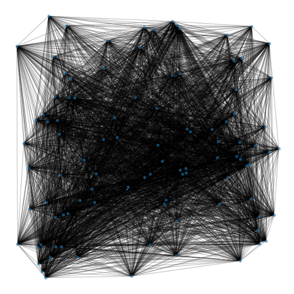

# Understanding the Covid-19 Outbreak   
This repository collects a series of experiments I conducted between March and April 2020 during my exchange at the University of Leeds. 

## The Idea
In march 2020, the Italian Government provided daily reports on the Covid-19 Cases for each city and region in Italy. In the middle of the pandemic the question was: can we spot a pattern in the spread of the virus? How do transportation and demographic properties of a region relate with this phenomenon? 
My research focuses on the application of statistical and machine-learning algorithms to model the study of this outbreak and attempt to answer to various questions.

## The Tasks

### Search Algorithms 
Application: optimal path with minimized security risk and congestion for transportation.
- A* Algorithm for Improved Trasportation Security during Lockdown ([Doc](docs/search_algorithms_covid19.pdf))

### Time Series Forecasting
Application: prediction of Covid-19 cases and future lockdowns.
- Feed Forward-LSTM (Multivariate): Italy ([Notebook](italy_multivariate_rnn_covid19.ipynb)), World ([Notebook](world_multivariate_rnn_covid19.ipynb))

### Link prediction
Application: geographical spread of the virus, hotspots prediction.
- Regression with Light GBM ([Notebook](link_prediction_graph_regression.ipynb))
- Logistic Regression([Notebook](link_prediction_graph_regression.ipynb))
- Temporal Graph Convolutional Network ([Notebook](t-gcn_covid19_cases.ipynb))

## Conclusions
Perhaps the main takeaway from this project is the necessity for further research on Temporal Graph Convolutional Neural Networks; Link prediction and Node features forecasting may allow us to predict the next local area at risk and a possible next wave of infections. LSTM networks and ARIMA weakly performed in times-series forecasting, probably due to an insufficient amount of records in the covid-19 cases dataset. Unfortunately, transportation data can be difficult to retrieve from public datasets, especially in spring 2020, when travel routes could suddendly change day by day. 
Nonetheless, this project left unaswered questions about:

- The correlation between climate and the spread of the Virus (especially in Italy), if any exists
- Which mean of transportation mostly contributed to the spread of the virus

## Credits
- A special thanks to Dr. Ali Gooya and Soodeh Kalaie, from [CISTIB Lab at the University of Leeds, UK](http://www.cistib.org/), for providing important references for this study.
- *"T-GCN: A Temporal Graph Convolutional Network for Traffic Prediction" (2018), Ling Zhao, Yujiao Song, Chao Zhang, Yu Liu, Pu Wang, Tao Lin, Min Deng, Haifeng Li* ([Paper](https://arxiv.org/abs/1811.05320))
- RamiKrispin ([Profile](https://github.com/RamiKrispin)): Covid-19 Daily Reports Dataset
- Presidenza del Consiglio dei Ministri - Dipartimento della Protezione Civile ([Profile](https://github.com/pcm-dpc)): Covid-19 Daily Reports Dataset

